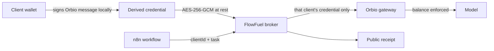

<p align="center">
  
</p>

<h1 align="center">FlowFuel</h1>

<p align="center">
  <strong>One agent. Many clients. Each client funds their own intelligence through an isolated Orbio balance.</strong>
</p>

<p align="center">
  <a href="https://flowfuel.midelabs.xyz"><strong>Live demo</strong></a> ·
  <a href="https://flowfuel.midelabs.xyz/proof">Proof page</a> ·
  Built on <a href="https://www.orbio.so">Orbio</a> + Robinhood Chain 4663, wired into n8n
</p>

<p align="center">
  <a href="https://github.com/mystiquemide/flowfuel/actions/workflows/ci.yml"></a>
  <a href="https://www.orbio.so"></a>
  <a href="https://n8n.io"></a>
  <a href="https://robin.etherscan.io"></a>
  <a href="LICENSE"></a>
</p>

FlowFuel is the operating layer for client-funded AI agents. An automation agency operates one shared Lead Intelligence Agent. Each client owns the wallet, activated Orbio balance, and wallet-derived credential that pays for work performed for that client.

Orbio turns inference into a wallet-funded onchain resource. FlowFuel uses that primitive to separate who operates an AI agent from who pays for its intelligence.

## 30-second proof


- Same n8n Lead Intelligence Agent, same task hash `7334a697…e013e`, three wallet identities.
- Client A (funded): two real Orbio generations completed, exactly `$0.000065` charged, balance `$0.008412 → $0.008348`. [Receipt](https://flowfuel.midelabs.xyz/api/runs/505513c6-4303-4a3a-a14e-9a39111fc13b/receipt)
- Client B (unfunded): `HTTP 401`, no generation ID, no charge, no fallback to any other balance. [Receipt](https://flowfuel.midelabs.xyz/api/runs/dbf5263e-0ef4-42d6-9d0c-e004b44ec54c/receipt)
- Client C (funded through `buyAndActivate`): the same agent completed with two generations and a `$0.000074` charge. [Receipt](https://flowfuel.midelabs.xyz/api/runs/e50a5419-328f-49b6-9aaa-9c70f0497d9f/receipt)
- A task priced above the balance: `HTTP 402`, nothing charged. [Receipt](https://flowfuel.midelabs.xyz/api/runs/b2996733-816d-4748-a7fd-20759c940e7a/receipt)
- Client C self-funded with USDG through the Orbio exchange's `buyAndActivate`, wallet as beneficiary. [Tx](https://robin.etherscan.io/tx/0x9e47efc19a22fb21d8e1bcc8ee1ad3759b2a88932bc269c9a4c7f94c3a50f8f9)
- Every proof value comes from a real execution, an Orbio gateway response, or an onchain transaction. FlowFuel preserves the resulting generation, cost, balance, and activation evidence in public-safe receipts.

## Live product paths

1. Open [/proof](https://flowfuel.midelabs.xyz/proof) for the public judge experiment and selected public receipts.
2. The private [/agency](https://flowfuel.midelabs.xyz/agency) workspace requires an operator session before it exposes customer operations or billable controls.
3. Client onboarding and dashboard links are sent to the corresponding client. Wallet-owned mutations still require EIP-191 signatures.

## The reference agent

The shared n8n workflow invokes one scoped Lead Intelligence Agent for every client:

1. Orbio interprets the lead input and selects the public website to inspect.
2. FlowFuel executes that constrained tool call with SSRF and response-size controls.
3. Orbio reasons over the observed site and returns schema-validated JSON with qualification, findings, risks, recommended action, confidence and source URLs.
4. n8n maps the structured qualification to `route_to_sales` or `manual_review`.

The plan and analysis are separate Orbio generations. FlowFuel stores both generation IDs and provider-precision costs, aggregates the charge from that same precision, and reconciles the aggregate against the wallet's balance change. Agent output is encrypted at rest so an idempotent retry returns the original useful result without another inference call.

## How it works

1. A client activates CREDIT on Robinhood Chain (or buys and activates in one `buyAndActivate` call with USDG). **Activation is one-way:** activated CREDIT becomes spendable inference balance; there is no deactivate path.
2. The client signs Orbio's authentication message locally. The signature derives the spend credential. The wallet private key never leaves the wallet and never reaches FlowFuel.
3. FlowFuel stores only the derived credential, encrypted at rest. n8n never sees it.
4. A run arrives as `clientId` plus a task. The broker resolves that client's credential, the Orbio gateway enforces that client's balance, and the run returns a public-safe receipt.
5. If the client has no activated balance, the gateway rejects the call. No agency balance exists to fall back to.



| Operation | What happens |
|---|---|
| Agency registers client | Record only. No credential, no money moves. |
| Client connects wallet | Verification signature, then credential signature. Two signatures, zero transactions. |
| Client activates CREDIT | Onchain activation, wallet's Orbio balance grows, tx hash recorded. Irreversible. |
| Client funds with USDG | Approve then `buyAndActivate` on the exchange, wallet recorded as beneficiary. |
| Workflow runs a task | Draws the named client's balance. Returns cost, generation ID, balance delta. |
| Client pauses | Signed intent. Next run is refused before inference. |
| Client revokes | Credential destroyed. Re-onboarding uses a new epoch. |

## Verified evidence

| Artifact | Value | Link |
|---|---|---|
| Funded agent receipt | Client A `succeeded`, two generations, $0.008412 - $0.000065 ≈ $0.008348, reconciled | [receipt](https://flowfuel.midelabs.xyz/api/runs/505513c6-4303-4a3a-a14e-9a39111fc13b/receipt) |
| Unfunded agent receipt | Client B `client_unfunded`, HTTP 401, zero generations, zero cost, zero fallback | [receipt](https://flowfuel.midelabs.xyz/api/runs/dbf5263e-0ef4-42d6-9d0c-e004b44ec54c/receipt) |
| Protocol-funded agent receipt | Client C `succeeded`, two generations, $0.000074 total cost | [receipt](https://flowfuel.midelabs.xyz/api/runs/e50a5419-328f-49b6-9aaa-9c70f0497d9f/receipt) |
| Over-quota run receipt | `402 insufficient_quota`, balance unchanged | [receipt](https://flowfuel.midelabs.xyz/api/runs/b2996733-816d-4748-a7fd-20759c940e7a/receipt) |
| Client A activation | `activate()` tx, beneficiary = A's wallet | [explorer](https://robin.etherscan.io/tx/0x229f5abb3baae5a1a104c4c6f294fdde05172885493fadf85f1aebfb7a4b40ed) |
| Client C direct activation | `activate()` tx, activation ID 239 | [explorer](https://robin.etherscan.io/tx/0x3654d2b614f4f62977ecf7059f99be021d6c1c27076325d077b4101fc1889889) |
| Client C exchange funding | `buyAndActivate` txs, activations 240 and 241, beneficiary = C's wallet | [tx 1](https://robin.etherscan.io/tx/0xfb47884fe7af03cff094935e4030603235e04f3d4354c40ae7fe6fa6ebf1f30b), [tx 2](https://robin.etherscan.io/tx/0x9e47efc19a22fb21d8e1bcc8ee1ad3759b2a88932bc269c9a4c7f94c3a50f8f9) |
| Client C funding evidence | 0.008 direct + 0.122887 + 0.131362 exchange = $0.261849 activated across the recorded funding transactions | [receipt](https://flowfuel.midelabs.xyz/api/runs/e50a5419-328f-49b6-9aaa-9c70f0497d9f/receipt) · [tx 1](https://robin.etherscan.io/tx/0xfb47884fe7af03cff094935e4030603235e04f3d4354c40ae7fe6fa6ebf1f30b) · [tx 2](https://robin.etherscan.io/tx/0x9e47efc19a22fb21d8e1bcc8ee1ad3759b2a88932bc269c9a4c7f94c3a50f8f9) |
| Contracts | CREDIT, Exchange, USDG on Robinhood Chain | [CREDIT](https://robin.etherscan.io/address/0xe33322da1380e61e5ae5dfb21e7f62924c73004c) · [Exchange](https://robin.etherscan.io/address/0x6951ffd32630b05e06f50062aea801625a58ebc0) · [USDG](https://robin.etherscan.io/address/0x5fc5360d0400a0fd4f2af552add042d716f1d168) |
| Attack coverage | Replay, spoofed client ID, wrong beneficiary, foreign emitter, reverted receipt, wrong sender, double-charge | `apps/web/test/chain.test.ts`, `apps/web/test/registration.test.ts`, `packages/db/test/stores.test.ts` |
| Tests | Full core, DB, broker and web suites run in CI | `pnpm test` |

## How this differs

| Alternative | What it does | Why FlowFuel is different |
|---|---|---|
| Shared agency API key | One provider account, blended usage, invoice arguments | Balance and enforcement live per client onchain, not in a spreadsheet |
| Per-client provider accounts | Clean separation, but N signups, N dashboards, N keys | One workflow, one broker, clients onboard with two signatures |
| Agency fronting spend | Simple, but the agency eats the bill and the disputes | Clients hold custody; the agency can never overspend a client |
| "Connect wallet to pay" demos | Wallet gates access, payment is a side quest | The wallet is the billing authority: activation, quota, and evidence all resolve onchain |

## Security boundary

- Wallet private keys never enter FlowFuel.
- The wallet-derived Orbio credential is encrypted at rest (AES-256-GCM) and can spend only the client's activated balance.
- Credentials never enter n8n workflow data, logs, URLs, or public receipts.
- Every run request is authenticated and tenant-bound by `clientId`; there is no fallback credential path.
- Public receipts expose an explicit safe-field allowlist only: no prompts, no completions, no credentials.
- Duplicate executions return the original encrypted result and receipt; concurrent requests serialize per client.
- Activation verification is onchain: correct chain, correct contract, real event, beneficiary must equal the client's wallet.
- Threat model and trust assumptions: [docs/ARCHITECTURE.md](docs/ARCHITECTURE.md).

## Honest limitations

- Unaudited. Do not point it at balances you cannot lose.
- The demo instance is a single self-hosted VM on a Cloudflare-proxied domain, not a hardened multi-zone deployment.
- All workflows share one bearer token today; per-workflow credentials are not built.
- Exchange-path activations index slower than direct `activate()`: observed roughly a 45-minute lag before the balance credited. They do land, just not instantly.
- Revoke is unit-tested; the destructive revoke path has not been exercised end-to-end on a live client.
- The broker is a trusted party: it holds encrypted credentials and the encryption key is a deployment secret. Self-hosting keeps that trust with the agency.
- Clients need a Robinhood Chain wallet with gas plus CREDIT or USDG. No fiat path, no simulated funding.

## Run locally

Requirements: Node 24, pnpm, Docker.

```bash
pnpm install
cp .env.example .env.local
# fill in DATABASE_URL, keys, tokens, and CLIENT_SESSION_SECRET
docker compose --env-file .env.local up -d postgres n8n
pnpm -F @flowfuel/db db:migrate
pnpm dev                     # web app on :3000 and broker on :4010
```

The root `pnpm dev` script starts both the web app and broker in parallel.

Import `n8n/workflows/client-funded-agent.json` into n8n. Set `FLOWFUEL_BROKER_URL` and `FLOWFUEL_WORKFLOW_TOKEN` in the n8n container environment. Set `AGENCY_PASSWORD` and an independent random `AGENCY_SESSION_SECRET` before opening the agency workspace.

## Future direction

Policy-based autonomous refueling is the next protocol-native step, not a shipped feature. A client could authorize a weekly maximum or a rule such as refuel $2 when inference balance falls below $0.50. The agent would detect low balance, FlowFuel would evaluate the client policy, an authorized path would acquire and activate CREDIT, and work could resume without unrestricted spending authority.

## Architecture

FlowFuel places an encrypted credential broker between n8n and Orbio. n8n sends a client ID and a task; the broker resolves that client's credential, reads that client's activated balance, executes, reconciles, and returns a secret-free receipt. Detail lives in [docs/ARCHITECTURE.md](docs/ARCHITECTURE.md). Layout: `apps/web` (Next.js app), `apps/broker` (run broker), `packages/core` (schemas, encryption, receipts, contract ABIs), `packages/db` (stores), `n8n/workflows` (importable reference workflow).

## License

MIT. See [LICENSE](LICENSE).
