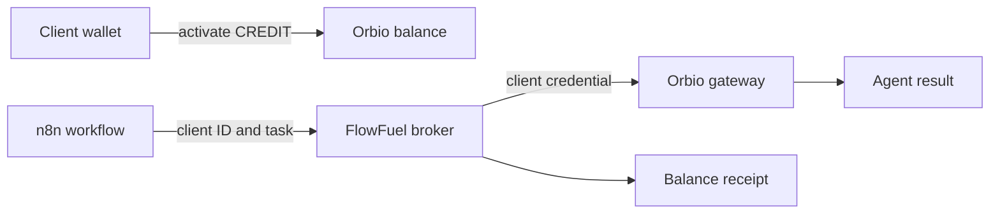

# FlowFuel

Your workflow. Their inference bill.

FlowFuel lets AI automation agencies operate one n8n workflow while each client runs against their own isolated Orbio balance.

The agency does not share a master model account across clients and does not need to front every client's inference cost. Clients keep wallet custody, activate only the allowance they intend to spend, and authorize a wallet-derived Orbio credential without exposing their private key.

## 30-second proof

- Client A activated CREDIT and completed the agent task.
- Client B attempted the same task without an activated balance and received `401 invalid_api_key`.
- A request above Client A's allowance received `402 insufficient_quota` without a charge.
- Client A's successful response included a real generation ID, usage cost, and reduced balance.
- No agency or different client balance paid for either failed request.

## The rule

> Every client runs against their own isolated Orbio balance.

## How it works

1. A client activates CREDIT for their wallet on Robinhood Chain.
2. The client signs the Orbio authentication message locally.
3. FlowFuel encrypts the derived spending credential.
4. n8n sends FlowFuel a client ID and bounded agent task.
5. FlowFuel executes through Orbio and returns a reconciled receipt.



## Verified evidence

The core mechanism has been exercised against the live Orbio protocol:

- A funded client completed direct and n8n inference calls.
- An unfunded client received a real `401 invalid_api_key` response.
- A request above the funded client's available balance received `402 insufficient_quota` without a charge.
- The successful run returned a real model ID, generation ID, token usage, cost, and reduced balance.
- Activated inference and unactivated CREDIT remained separate.

Activation transaction:

[`0x229f5abb3baae5a1a104c4c6f294fdde05172885493fadf85f1aebfb7a4b40ed`](https://robin.etherscan.io/tx/0x229f5abb3baae5a1a104c4c6f294fdde05172885493fadf85f1aebfb7a4b40ed)

The final receipt joins the activation, matching task hash, generation ID, gateway status, usage cost, and balance reconciliation in one public-safe record.

## Architecture

FlowFuel places an encrypted credential broker between n8n and Orbio. n8n never receives a client's Orbio credential. The broker resolves one client, reads that client's activated balance, executes the request, reconciles the result, and returns a secret-free receipt.

See [Architecture](docs/ARCHITECTURE.md) and [Design system](docs/DESIGN.md).

## Security boundary

- Wallet private keys never enter FlowFuel.
- Wallet-derived Orbio credentials are encrypted at rest.
- Credentials never enter n8n workflow data or public receipts.
- Every n8n request is authenticated and tenant-bound.
- Failed funding checks never fall back to an agency or different client credential.
- Public proof views use an explicit safe-field allowlist.
- Duplicate n8n executions are idempotent and cannot charge twice.
- Concurrent client requests are serialized against the allowance.

## Why Orbio is required

FlowFuel depends on Orbio's CREDIT lifecycle:

- Transferable CREDIT before activation.
- Wallet-specific inference balance after activation.
- Wallet-signed OpenAI-compatible credentials.
- Gateway-enforced balance limits.
- Live usage and balance evidence.

Without those primitives, the agency returns to provider accounts, shared funding pools, and manual reconciliation.

## Configuration

Copy `.env.example` to `.env.local` and provide independent application, database, encryption, and workflow secrets. Never reuse a wallet private key as an application secret.

## Run it

Requirements: Node 24, pnpm, Docker.

```bash
pnpm install
docker compose up -d postgres
cp .env.example .env.local   # fill in DATABASE_URL, keys, tokens
pnpm -F @flowfuel/db db:migrate
pnpm -F @flowfuel/broker dev # broker on :4010
pnpm dev                     # web app on :3000
```

Start n8n with `docker compose up -d n8n`, then import `n8n/workflows/client-funded-agent.json`. The workflow calls `POST /api/runs` with the shared `FLOWFUEL_WORKFLOW_TOKEN`; set `FLOWFUEL_BROKER_URL` and `FLOWFUEL_WORKFLOW_TOKEN` in the n8n container environment.

## Repository layout

- `apps/broker` — standalone run broker (node:http, port 4010)
- `apps/web` — Next.js app: client onboarding, run API, public receipts
- `packages/core` — schemas, error mapping, encryption, receipt logic
- `packages/db` — Drizzle schema, stores, migrations
- `n8n/workflows` — the importable reference workflow

## API surface

- `POST /api/runs` — execute a client task (Bearer workflow token)
- `GET /api/runs/[runId]` — run status (Bearer workflow token)
- `GET /api/runs/[runId]/receipt` — public proof receipt, no token
- `GET /healthz` — broker liveness

## License

License to be selected before public release.
