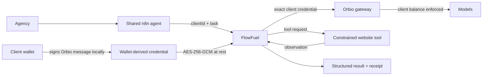

<p align="center">
  
</p>

<h1 align="center">FlowFuel</h1>

<p align="center">
  <strong>One agent. Many clients. Each client funds their own intelligence.</strong>
</p>

<p align="center">
  <strong>A client-funded agent runtime for AI automation agencies, built on Orbio.</strong>
</p>

<p align="center">
  <a href="https://flowfuel.midelabs.xyz"><strong>Live app</strong></a> ·
  <a href="https://flowfuel.midelabs.xyz/proof"><strong>Proof</strong></a> ·
  <a href="docs/ARCHITECTURE.md"><strong>Architecture</strong></a> ·
  <a href="https://sellers.orbio.so/build"><strong>Orbio Build Week</strong></a>
</p>

<p align="center">
  <a href="https://github.com/mystiquemide/flowfuel/actions/workflows/ci.yml"></a>
  <a href="https://www.orbio.so"></a>
  <a href="https://n8n.io"></a>
  <a href="https://robin.etherscan.io"></a>
  <a href="LICENSE"></a>
</p>

---

## The idea

AI automation agencies already know how to reuse one workflow across many clients. The harder problem is paying for the intelligence behind it.

Today an agency usually has to choose between weak options:

- put every client on one provider account and reconcile usage later
- create separate provider projects while still funding the shared account
- ask every client to create provider accounts, add cards, and hand over keys
- estimate inference costs inside a retainer and absorb the variance

FlowFuel removes that tradeoff.

**The agency operates the agent. The client funds the intelligence.**

An agency can run one shared AI agent across many customers while every run is bound to the correct customer's wallet-derived Orbio credential and activated balance.

The workflow stays shared. The agent stays shared. **The payer changes per run.**

---

## Built for Orbio Build Week

The Build Week theme is **“Build an agent on your key.”**

FlowFuel takes that literally, but pushes it into a real multi-client operating model.

The shipped reference workload is a **Lead Intelligence Agent** running through one shared n8n workflow. FlowFuel is the runtime around that agent: it resolves the correct client identity, funds the run from that client's Orbio balance, executes the agent, reconciles the cost, and returns a secret-free result.

### Why the reference workload is a real agent

It is not a one-shot prompt wrapper.

For every lead, the agent:

```text
receives a goal
→ plans what it needs to inspect
→ selects inspect_public_website
→ executes a real external tool call
→ observes the website
→ reasons over the observation
→ returns schema-validated qualification
→ drives the next n8n action
```

The planning and analysis are separate Orbio generations.

**Reasoning is agentic. Spending policy is deterministic.**

The model can decide how to investigate a lead. It cannot decide whose balance pays for that investigation.

---

## Why Orbio matters

FlowFuel depends on a property that ordinary provider API keys do not give us cleanly: **wallet-funded inference as a programmable economic identity.**

Orbio's CREDIT protocol makes inference something a wallet can hold, activate, and use through a wallet-derived gateway credential. FlowFuel uses that primitive as the boundary between clients.

For each client, FlowFuel works with:

- Robinhood Chain 4663
- CREDIT
- `activate()`
- USDG
- Orbio Exchange `getQuote()`
- `buyAndActivate()`
- beneficiary activation
- wallet-derived Orbio credentials
- `/api/v1/key`
- `/api/v1/chat/completions`
- model/tool calling
- generation IDs and token usage
- per-generation and aggregate cost evidence

This changes the agency model from:

```text
one agency provider account
→ many clients
→ blended inference bill
```

to:

```text
                    one shared agent
                           │
                        FlowFuel
                 ┌─────────┼─────────┐
                 ↓         ↓         ↓
             Client A   Client B   Client C
             Orbio      Orbio      Orbio
             balance    balance    balance
                 ↓         ↓         ↓
               A pays    B pays    C pays
```

That separation is the product.

---

## Why this matters to the Orbio ecosystem

FlowFuel shows a commercial use case for Orbio beyond one developer using one inference key.

It makes wallet-funded inference useful for businesses that **operate agents on behalf of other people**.

The same architecture can support:

- AI automation agencies
- AI consultancies
- managed agent services
- vertical SaaS with customer-funded AI
- white-label agents
- multi-department agent deployments
- marketplaces where one operator serves many independently funded users

The Lead Intelligence Agent is the reference workload, not the limit of the product.

The invariant is:

```text
client identity
→ client credential
→ client Orbio balance
→ agent execution
```

FlowFuel separates **operational ownership** from **economic ownership**.

---

## 30-second proof


One shared n8n Lead Intelligence Agent. The same task shape. Three client identities.

| Client | Funding state | Result | Who paid? |
|---|---|---|---|
| **A** | Funded | Two Orbio generations, agent succeeds | Client A |
| **B** | Unfunded | HTTP 401, zero generations, zero charge | Nobody |
| **C** | Funded through `buyAndActivate()` | Same agent succeeds | Client C |

The important part is what **does not** happen:

**Client B never falls back to Client A or Client C.**

That behavior is enforced by the runtime, not requested from the model.

### Canonical recorded executions

- **Client A:** two real Orbio generations, exactly `$0.000065` charged, balance `$0.008412 → $0.008348`. [Receipt](https://flowfuel.midelabs.xyz/api/runs/505513c6-4303-4a3a-a14e-9a39111fc13b/receipt)
- **Client B:** `HTTP 401`, zero generations, zero charge, no fallback. [Receipt](https://flowfuel.midelabs.xyz/api/runs/dbf5263e-0ef4-42d6-9d0c-e004b44ec54c/receipt)
- **Client C:** funded through `buyAndActivate()`, then the same agent completed with two generations and a `$0.000074` aggregate charge. [Receipt](https://flowfuel.midelabs.xyz/api/runs/e50a5419-328f-49b6-9aaa-9c70f0497d9f/receipt)
- **Over-quota run:** `HTTP 402`, nothing charged. [Receipt](https://flowfuel.midelabs.xyz/api/runs/b2996733-816d-4748-a7fd-20759c940e7a/receipt)
- **Protocol funding:** Client C self-funded with USDG through the Orbio Exchange and `buyAndActivate()`, with the client wallet as beneficiary. [Transaction](https://robin.etherscan.io/tx/0x9e47efc19a22fb21d8e1bcc8ee1ad3759b2a88932bc269c9a4c7f94c3a50f8f9)

Every proof value above comes from a real execution, an Orbio gateway response, or an onchain transaction. FlowFuel preserves selected generation, cost, balance, and activation evidence in public-safe receipts.

---

## Why FlowFuel fits the brief

### 1. Agent

The shipped agent plans, selects a tool, observes an external system, reasons over the result, produces structured output, and drives a downstream action.

### 2. Engineering

FlowFuel treats economic isolation as infrastructure, not an instruction to the model.

The implementation includes:

- exact client-bound credential lookup
- AES-256-GCM encrypted credentials
- wallet ownership verification
- agency sessions and client-bound sessions
- no fallback credential path
- idempotent encrypted-result replay
- per-client request serialization
- multi-generation accounting
- balance reconciliation
- historical activation snapshots
- SSRF-hardened website inspection with IP pinning and a streaming body cap
- strict public receipt allowlists
- CI across core, DB, broker, and web packages
- a real deployed VPS environment

### 3. Orbio ecosystem value

FlowFuel turns Orbio's wallet-funded inference into infrastructure for multi-client agent businesses.

**One agent can serve many customers without one operator becoming the economic owner of everyone's inference.**

---

## How FlowFuel works



A run follows this path:

1. n8n submits a `clientId` and bounded agent task.
2. FlowFuel resolves exactly that client's encrypted Orbio credential.
3. FlowFuel reads that client's live Orbio balance.
4. Orbio performs the planning generation.
5. The agent selects `inspect_public_website`.
6. FlowFuel executes the constrained website observation.
7. Orbio performs the analysis generation.
8. FlowFuel validates the structured result.
9. FlowFuel waits for the settled balance and reconciles the aggregate charge.
10. The useful result is encrypted for idempotent replay.
11. n8n routes the next action.

If the named client cannot fund the run, execution stops. There is no agency balance and no alternate client credential to fall back to.

---

## Product surfaces

- **[Live app](https://flowfuel.midelabs.xyz)** — product overview and client-funded agent story
- **[Public proof](https://flowfuel.midelabs.xyz/proof)** — selected recorded live executions and public receipts
- **[/agency](https://flowfuel.midelabs.xyz/agency)** — private operator workspace for client operations and billable controls
- **Client onboarding** — wallet connection, CREDIT activation, USDG `buyAndActivate()`, credential registration
- **Client dashboard** — client-authenticated balance, usage, funding, pause/resume, and credential controls
- **[Architecture](docs/ARCHITECTURE.md)** — trust boundaries, data model, execution path, and failure model
- **[n8n workflow](n8n/workflows/client-funded-agent.json)** — importable reference agent workflow

---

## Client lifecycle

| Operation | What happens |
|---|---|
| Agency registers client | Creates the tenant record. No credential and no funds move. |
| Client opens onboarding | Receives a minimal public bootstrap view. Private operational detail remains protected. |
| Client verifies wallet | Signs a nonce and receives a short-lived client-bound session. |
| Client registers Orbio credential | Signs the Orbio key message locally; FlowFuel stores only the encrypted derived credential. |
| Client activates CREDIT | Onchain activation becomes spendable inference balance. |
| Client funds with USDG | `approve` then `buyAndActivate` through the Orbio Exchange. |
| Shared agent runs | FlowFuel resolves the named client's credential and balance. |
| Client pauses | Signed intent blocks future runs before inference. |
| Client revokes | Credential is destroyed; re-onboarding requires a new epoch. |

Wallet private keys never enter FlowFuel.

---

## Verified evidence

| Artifact | Evidence |
|---|---|
| Funded agent | [Client A receipt](https://flowfuel.midelabs.xyz/api/runs/505513c6-4303-4a3a-a14e-9a39111fc13b/receipt) |
| Unfunded isolation | [Client B receipt](https://flowfuel.midelabs.xyz/api/runs/dbf5263e-0ef4-42d6-9d0c-e004b44ec54c/receipt) |
| Protocol-funded agent | [Client C receipt](https://flowfuel.midelabs.xyz/api/runs/e50a5419-328f-49b6-9aaa-9c70f0497d9f/receipt) |
| Over-quota rejection | [402 receipt](https://flowfuel.midelabs.xyz/api/runs/b2996733-816d-4748-a7fd-20759c940e7a/receipt) |
| Client A `activate()` | [Explorer](https://robin.etherscan.io/tx/0x229f5abb3baae5a1a104c4c6f294fdde05172885493fadf85f1aebfb7a4b40ed) |
| Client C direct activation | [Explorer](https://robin.etherscan.io/tx/0x3654d2b614f4f62977ecf7059f99be021d6c1c27076325d077b4101fc1889889) |
| Client C exchange funding | [Tx 1](https://robin.etherscan.io/tx/0xfb47884fe7af03cff094935e4030603235e04f3d4354c40ae7fe6fa6ebf1f30b) · [Tx 2](https://robin.etherscan.io/tx/0x9e47efc19a22fb21d8e1bcc8ee1ad3759b2a88932bc269c9a4c7f94c3a50f8f9) |
| Contracts | [CREDIT](https://robin.etherscan.io/address/0xe33322da1380e61e5ae5dfb21e7f62924c73004c) · [Exchange](https://robin.etherscan.io/address/0x6951ffd32630b05e06f50062aea801625a58ebc0) · [USDG](https://robin.etherscan.io/address/0x5fc5360d0400a0fd4f2af552add042d716f1d168) |
| CI | [GitHub Actions](https://github.com/mystiquemide/flowfuel/actions/workflows/ci.yml) |

---

## Why not just use normal provider keys?

| Approach | Problem | FlowFuel |
|---|---|---|
| One shared agency API account | Blended usage and shared economic risk | Every client has an isolated Orbio balance |
| Separate provider project per client | Operational overhead still sits with the agency | One broker and one shared agent |
| Ask clients for provider accounts and cards | High onboarding friction | Wallet signatures + Orbio |
| Agency fronts inference | Agency absorbs usage variance and collection risk | Client funds their own inference |
| Wallet-gated AI demo | Wallet controls access but not the actual inference economy | Wallet-derived credential and balance fund the real model calls |

---

## Security model

- Wallet private keys never enter FlowFuel.
- Wallet-derived Orbio credentials are encrypted at rest with AES-256-GCM.
- Credential encryption is bound to client identity, wallet, chain, and epoch.
- Credentials never enter n8n workflow payloads, URLs, logs, or public receipts.
- Every run resolves one credential by exact client ID.
- There is no fallback agency or alternate-client model credential.
- Agency operations require an authenticated operator session.
- Client private reads require a matching wallet-authenticated client session.
- Wallet-owned mutations retain their signature/onchain checks.
- Duplicate workflow executions return the original encrypted result without another inference call.
- Public receipts are strict allowlist projections and contain no prompt, result plaintext, credential, or deployment secret.
- Website inspection rejects non-global targets, pins validated IPs, revalidates redirects, and aborts bodies above the configured limit.
- Activation verification checks the expected chain, contract, event, sender, beneficiary, and transaction success.

See [docs/ARCHITECTURE.md](docs/ARCHITECTURE.md) for the complete trust model.

---

## Run FlowFuel yourself

Requirements:

- Node.js 22+
- pnpm 11+
- Docker
- an Orbio-compatible Robinhood Chain setup for live protocol flows

### 1. Install

```bash
pnpm install
cp .env.example .env.local
```

### 2. Generate the agency and service secrets

FlowFuel is currently designed as a **self-hosted agency instance**. The deployer chooses the operator password.

Generate a human login password:

```bash
python -c "import secrets; print(secrets.token_urlsafe(18))"
```

Generate the machine secrets separately:

```bash
openssl rand -hex 32   # AGENCY_SESSION_SECRET
openssl rand -hex 32   # CLIENT_SESSION_SECRET
openssl rand -hex 32   # CREDENTIAL_ENCRYPTION_KEY
openssl rand -hex 32   # FLOWFUEL_WORKFLOW_TOKEN
```

Put them in `.env.local`:

```env
AGENCY_PASSWORD=<operator password>
AGENCY_SESSION_SECRET=<independent 64-character secret>
CLIENT_SESSION_SECRET=<independent 64-character secret>
CREDENTIAL_ENCRYPTION_KEY=<64-character hex key>
FLOWFUEL_WORKFLOW_TOKEN=<independent 64-character token>
```

**`AGENCY_PASSWORD` is the only one the human operator types into `/agency/login`.**  
The other values are deployment secrets and should never be entered into the browser UI.

### 3. Start infrastructure

```bash
docker compose --env-file .env.local up -d postgres n8n
pnpm -F @flowfuel/db db:migrate
```

### 4. Start FlowFuel

```bash
pnpm dev
```

The root development command starts both the web application and broker.

Import:

```text
n8n/workflows/client-funded-agent.json
```

into n8n. The workflow reads `FLOWFUEL_BROKER_URL` and `FLOWFUEL_WORKFLOW_TOKEN` from its container environment. It never contains a client Orbio credential.

---

## Repository layout

```text
apps/
  web/       Next.js product, onboarding, agency workspace and public proof
  broker/    client-bound agent execution and Orbio integration

packages/
  core/      schemas, crypto, receipts and contract definitions
  db/        tenant, credential, activation and run persistence

n8n/
  workflows/ shared Lead Intelligence Agent

docs/
  ARCHITECTURE.md
```

---

## Future direction

The next protocol-native step is **policy-controlled autonomous refueling**.

A client could authorize a bounded rule such as:

```text
if inference balance < $0.50
and weekly refuel spend < $2
→ acquire and activate CREDIT
→ continue work
```

That is intentionally **not shipped yet**. FlowFuel currently does not give the runtime unrestricted automated USDG spending authority.

The broader direction is to make client-funded agent infrastructure reusable across many agent workloads while keeping the payer boundary enforceable outside the model.

---

## Honest limitations

- FlowFuel is unaudited.
- The demo is deployed on a single self-hosted VPS, not a multi-zone production architecture.
- n8n currently uses one shared workflow bearer token.
- Per-client execution locking assumes one broker replica.
- The broker is trusted with the credential-encryption key.
- Exchange-path activation can take time to appear in the gateway index.
- The destructive live revoke path is unit-tested but has not been exercised end-to-end against the canonical demo clients.
- Server-side Orbio web search was not available through the current wallet-gateway path, so the reference agent uses a constrained client-side website tool.
- Autonomous refueling is future work, not a current product claim.

---

## The thesis

Most agent systems assume the person running the agent is also the person paying for it.

FlowFuel removes that assumption.

**The agency owns the operation.  
The client owns the inference.**

**One agent. Many clients. Each client funds their own intelligence.**

## License

MIT. See [LICENSE](LICENSE).
