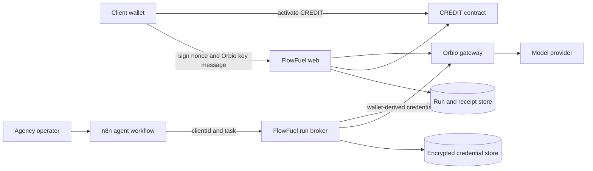
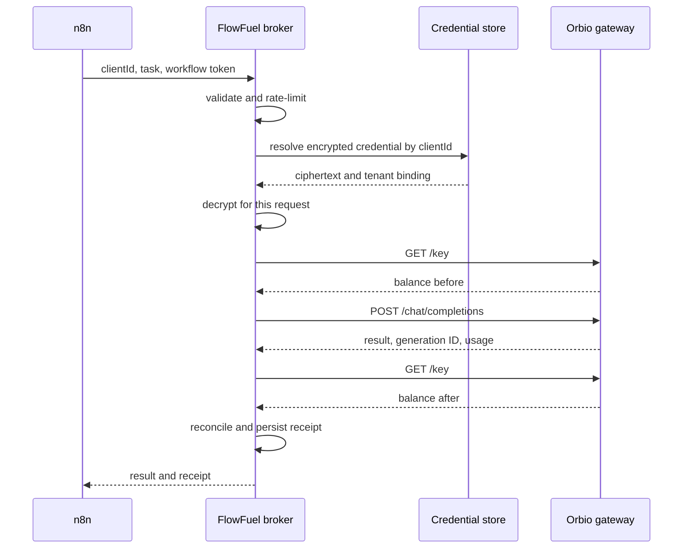

# FlowFuel architecture

Version: 0.1  
Date: September 18, 2026

## 1. Objective

FlowFuel lets one n8n workflow execute AI tasks for multiple clients without sharing an agency-funded model account. Each run resolves one client's encrypted wallet-derived Orbio credential, uses only that client's activated balance, and produces a reconciled receipt.

The architecture exists to enforce one rule:

> Every client runs against their own isolated Orbio balance.

## 2. System context



## 3. Components

### 3.1 Web application

Responsibilities:

- Agency authentication for private operational views.
- Client wallet connection and ownership proof.
- Activation guidance and transaction receipt tracking.
- Local creation of the wallet-derived Orbio API credential.
- Explicit consent before sending the derived credential to FlowFuel.
- Client status, run history, and proof receipt rendering.
- Public-safe proof page for judging.

The browser never sends a wallet private key to FlowFuel.

### 3.2 Run broker

Responsibilities:

- Authenticate n8n requests.
- Validate `clientId`, task type, input size, selected model, and output limit.
- Resolve exactly one encrypted client credential.
- Read the client's activated balance before inference.
- Call the Orbio gateway.
- Read the balance after inference.
- Normalize gateway errors without hiding upstream evidence.
- Write a terminal run record that application code cannot rewrite after completion.

The broker is the only component allowed to decrypt an Orbio credential.
It never retries under a different credential. Funding failure is terminal for that run.

### 3.3 Credential vault

For the hackathon build, the credential vault is an encrypted database record rather than a separate secret-management service.

Requirements:

- AES-256-GCM encryption.
- Unique random IV per encryption.
- Associated data bound to `clientId`, wallet address, chain ID, and epoch.
- Credential fingerprint stored separately for audit and rotation.
- Plaintext exists only for the duration of one gateway request.
- No secret in logs, error objects, analytics, workflow output, or browser-rendered data.

### 3.4 n8n workflow

The workflow contains one FlowFuel HTTP request, not one Orbio credential per client. The reference workload is a scoped Lead Intelligence Agent: Orbio plans a constrained website-inspection tool call, FlowFuel executes the observation, and Orbio returns schema-validated qualification data in a second generation.

Input contract:

```json
{
  "clientId": "client_a",
  "task": {
    "type": "lead_intelligence",
    "input": "Summarize this qualified lead and propose the next action."
  }
}
```

n8n authenticates with a FlowFuel workflow token. It never receives the client Orbio credential.

### 3.5 Orbio integration

Network and contracts:

- Robinhood Chain ID: `4663`.
- CREDIT: `0xe33322da1380e61e5ae5dfb21e7f62924c73004c`.
- Gateway base URL: `https://www.orbio.so/api/v1`.

Wallet authentication message:

```text
Orbio API key · chain 4663 · epoch N
```

Credential shape:

```text
sk-orb-N-<base64-signature>
```

Required gateway operations:

- `GET /models`
- `GET /key`
- `POST /chat/completions`

Expected proof headers and fields:

- `X-Orbio-Balance`
- generation ID
- provider model ID
- token usage
- cost

## 4. Proposed repository structure

```text
flowfuel/
  apps/
    web/
      src/app/
        page.tsx
        agency/page.tsx
        clients/[clientId]/page.tsx
        proof/[runId]/page.tsx
        connect/[clientId]/page.tsx
        api/auth/nonce/route.ts
        api/auth/verify/route.ts
        api/clients/[clientId]/credential/route.ts
        api/runs/route.ts
        api/runs/[runId]/route.ts
      src/components/
      src/lib/
    broker/
      src/server.ts
      src/run-client-task.ts
      src/orbio.ts
      src/auth.ts
  packages/
    core/
      src/crypto.ts
      src/contracts.ts
      src/schemas.ts
      src/receipts.ts
      src/errors.ts
    db/
      src/schema.ts
      src/client-store.ts
      src/credential-store.ts
      src/run-store.ts
      drizzle/
  n8n/
    workflows/client-funded-agent.json
  docs/
    ARCHITECTURE.md
  .env.example
  README.md
```

The web and broker may share one deployment during the hackathon if that reduces operational risk. The module boundary remains explicit so secrets and public rendering stay separated.

## 5. Data model

### clients

| Field | Type | Rules |
|---|---|---|
| id | UUID | Primary key |
| slug | text | Unique, immutable after first run |
| display_name | text | Required |
| wallet_address | address | Unique, checksummed |
| chain_id | integer | Must equal 4663 |
| status | enum | pending, ready, unfunded, paused, revoked |
| created_at | timestamp | Server time |
| updated_at | timestamp | Server time |

### wallet_nonces

| Field | Type | Rules |
|---|---|---|
| nonce | UUID | Primary key, random |
| client_id | UUID | Foreign key |
| purpose | enum | connect, register_credential, rotate_credential |
| expires_at | timestamp | Short lifetime |
| consumed_at | timestamp | Null until verified |

### client_credentials

| Field | Type | Rules |
|---|---|---|
| client_id | UUID | Primary key and foreign key |
| wallet_address | address | Must match client |
| epoch | integer | Non-negative |
| ciphertext | binary | AES-256-GCM output |
| fingerprint | text | SHA-256 digest, never reversible |
| verified_balance | decimal | Last successful gateway read |
| verified_at | timestamp | Last read time |
| rotated_at | timestamp | Nullable |

### activations

| Field | Type | Rules |
|---|---|---|
| id | UUID | Primary key |
| client_id | UUID | Foreign key |
| transaction_hash | bytes32 | Unique |
| activation_id | integer | Onchain activation ID |
| amount_usd | decimal | Positive |
| block_number | bigint | Required after confirmation |
| status | enum | pending, confirmed, failed |
| created_at | timestamp | Server time |

### runs

| Field | Type | Rules |
|---|---|---|
| id | UUID | Primary key |
| client_id | UUID | Foreign key |
| workflow_run_id | text | Optional n8n execution ID |
| task_type | text | Allowlisted |
| model | text | Allowlisted |
| status | enum | running, succeeded, client_unfunded, quota_exceeded, provider_failed, validation_failed |
| generation_id | text | Present only for successful provider execution |
| balance_before | decimal | Live Orbio value |
| balance_after | decimal | Live Orbio value when available |
| cost_usd | decimal | Live provider value when available |
| prompt_tokens | integer | No prompt text stored |
| completion_tokens | integer | Non-negative |
| error_code | text | Normalized code |
| upstream_status | integer | Original HTTP status |
| task_hash | text | SHA-256 of canonical task input |
| idempotency_key | text | Unique per workflow execution |
| started_at | timestamp | Required |
| completed_at | timestamp | Required for terminal state |

### audit_events

| Field | Type | Rules |
|---|---|---|
| id | UUID | Primary key |
| client_id | UUID | Nullable for system events |
| actor_type | enum | client, agency, workflow, system |
| event_type | text | Allowlisted |
| public_data | JSON | Secret-free structured data |
| created_at | timestamp | Required |

## 6. API contracts

### POST /api/auth/nonce

Request:

```json
{
  "clientId": "uuid",
  "purpose": "register_credential"
}
```

Response:

```json
{
  "nonce": "uuid",
  "message": "FlowFuel credential registration\nClient: uuid\nWallet: 0x...\nNonce: uuid\nExpires: 2026-09-18T18:00:00Z"
}
```

### POST /api/auth/verify

Verifies wallet control and consumes the nonce once. It does not register the Orbio credential.

### PUT /api/clients/:clientId/credential

Authenticated client request containing:

```json
{
  "walletAddress": "0x...",
  "epoch": 0,
  "orbioCredential": "secret value",
  "consent": true
}
```

The server immediately validates the credential with `GET /key`, encrypts it, clears plaintext references, and returns only status and balance.

### POST /api/runs

Authenticated n8n request:

```json
{
  "clientId": "uuid",
  "workflowRunId": "n8n-execution-id",
  "task": {
    "type": "lead_intelligence",
    "input": "bounded task input"
  },
  "model": "google/gemini-2.5-flash",
  "maxOutputTokens": 200
}
```

Successful response:

```json
{
  "runId": "uuid",
  "status": "succeeded",
  "result": "agent output",
  "receipt": {
    "clientWallet": "0x...",
    "generationId": "gen-...",
    "model": "google/gemini-2.5-flash",
    "costUsd": "0.000026",
    "balanceBefore": "0.010000",
    "balanceAfter": "0.009974"
  }
}
```

Normalized funding response:

```json
{
  "runId": "uuid",
  "status": "client_unfunded",
  "error": {
    "code": "CLIENT_UNFUNDED",
    "upstreamStatus": 401,
    "action": "Activate CREDIT for this client wallet."
  }
}
```

### GET /api/runs/:runId

Private callers receive operational details. Public proof pages receive a secret-free projection.

## 7. Execution sequence



## 8. Error model

| Upstream condition | FlowFuel status | Product behavior |
|---|---|---|
| 401 invalid API key before activation | client_unfunded | Stop and request activation or credential verification |
| 401 revoked or rotated key | credential_revoked | Stop and request re-signing |
| 402 insufficient quota | quota_exceeded | Stop, record unchanged balance, request top-up |
| 429 rate limited | provider_failed | Retry only within a bounded policy |
| 5xx provider failure | provider_failed | Do not claim successful work |
| response schema mismatch | provider_failed | Preserve status and safe excerpt, alert operator |
| receipt imbalance | reconciliation_failed | Hide success state until investigated |

## 9. Security boundaries

### Trusted

- Server runtime that holds the encryption key.
- Database ciphertext and public metadata.
- Verified Robinhood Chain state.
- Authenticated Orbio gateway responses.

### Untrusted

- Browser input.
- n8n task input.
- Model output.
- RPC providers until chain ID and result shape are checked.
- Any client-supplied transaction hash until receipt validation.

### Required controls

- CSRF protection for browser mutations.
- Single-use nonces for wallet proofs.
- Constant-time comparison for workflow tokens.
- Strict request and response schemas.
- Per-client concurrency lock.
- Maximum input bytes and output tokens.
- Model allowlist.
- Secret redaction in structured logs.
- No prompt or response retention by default.
- Public receipt projection built from an explicit allowlist.
- Encryption-key rotation procedure documented before production use.

## 10. Proof contract

The judge-facing proof is accepted only if it contains:

- Client A wallet address.
- Client B wallet address.
- CREDIT activation transaction hash for Client A.
- Same workflow and task shape for both clients.
- Client A successful generation ID and cost.
- Client A before and after activated balances.
- Client B upstream 401 and normalized unfunded state.
- Client A upstream 402 for a request above its remaining activated balance.
- No successful generation ID for either failed request.

## 11. Architecture decisions

### ADR-001: Use an encrypted credential broker

Decision: n8n calls FlowFuel rather than holding arbitrary client Orbio credentials.

Reason: standard n8n nodes resolve credentials statically. A broker supports one workflow path, keeps credentials out of execution data, and centralizes receipts.

### ADR-002: Clients keep wallet custody

Decision: wallet signing happens in the browser and private keys never reach the server.

Reason: the API credential is sufficient to spend activated inference. FlowFuel does not need token custody.

### ADR-003: Reconcile every run

Decision: successful runs require live balance-before, usage-cost, and balance-after evidence.

Reason: a model response alone does not prove who paid.

### ADR-004: Store no prompt text by default

Decision: receipts contain task type, token counts, cost, and identifiers, not prompts or completions.

Reason: agencies may process confidential client data. Public proof does not need content.

### ADR-005: Use one bounded task for the winning core

Decision: the reference n8n agent performs one commercially understandable task, such as lead qualification and CRM-ready next-action output.

Reason: the billing mechanism must remain the hero. Multiple agent features would distract from proof.

### ADR-006: Never fall back to another payer

Decision: a missing, revoked, unfunded, or exhausted client credential ends the run.

Reason: fallback would violate the winning invariant even if the task succeeded.

### ADR-007: Make workflow retries idempotent

Decision: the n8n execution ID is unique. Terminal retries return the original receipt.

Reason: automation platforms retry and must not charge twice.

### ADR-008: Hash the task before funding resolution

Decision: canonicalize and hash the bounded task before selecting a credential.

Reason: funded and unfunded receipts must prove they attempted the same work without exposing content.

## 12. Verification matrix

| Requirement | Unit test | Integration test | Live proof |
|---|---|---|---|
| Credential encryption | Round-trip, wrong AAD fails | DB record cannot decrypt under another client | Secret scan and log inspection |
| Client isolation | Resolver returns exact tenant only | Concurrent A and B requests | A succeeds, B fails |
| Wallet ownership | Nonce expiry and replay | Browser signature verification | Real wallet connection |
| Activated balance | Schema parsing | Gateway `/key` call | Exact live balance |
| Successful execution | Receipt arithmetic | n8n to broker to Orbio | Generation ID and charged balance |
| Unfunded rejection | Error normalization | Same n8n workflow for B | Live HTTP 401 |
| Quota rejection | Error normalization | Oversized request | Live HTTP 402, no charge |
| Public proof safety | Projection allowlist | Route snapshot | Browser and source inspection |
| Duplicate execution | Idempotency tests | Concurrent duplicates | One charged receipt |
| No payer fallback | Static path assertion | B while A is funded | B fails and A stays unchanged |
| Same task | Canonical hash tests | A and B in one execution | Matching task hash |

## 13. Frozen submission locks

| Boundary | Frozen decision |
|---|---|
| Wallet custody | Client keeps the private key |
| Spending authority | Derived credential spends activated inference only |
| n8n secret | n8n stores only the FlowFuel workflow token |
| Tenant selection | Authenticated server-side lookup |
| Activation readiness | Confirm receipt, then confirm gateway balance |
| Retry behavior | Idempotent by n8n execution ID |
| Concurrency | One active gateway request per client |
| Failure | No credential fallback |
| Receipt | Before, cost, after, generation ID, task hash |
| Public data | Explicit safe-field allowlist |
| Contracts | Use Orbio contracts, add no custom contract |

## 14. Deployment boundary

No deployment is authorized by this document.

When approved:

- Web and broker may deploy as one service for the hackathon.
- PostgreSQL stores application records.
- n8n may run locally or on an isolated host and communicates over HTTPS.
- Secrets live only in deployment environment variables.
- Production must use a new source wallet and never the private key exposed during feasibility testing.
